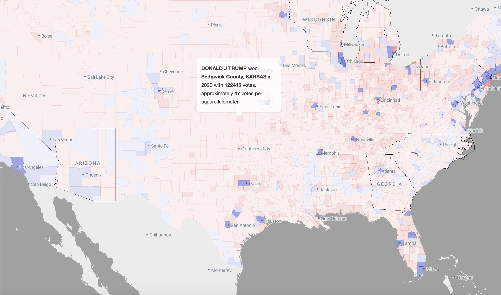

## Hello! 👋

This excercise was prepared for Practical Cartography Day at NACIS 2024 in Tacoma, Washington.

You are invited to modify this election map showing results of the 2020 election by county, with the "swing states" outlined in black:


[View live map here](https://mizmay.github.io/WebMapStarterKit/)

Here's the Abstract of my talk: 

> Ever wondered how you can create custom web maps for your portfolio, passion project, or job WITHOUT setting up a tile server, web server, or cloud services account? Hoping to do it without too much coding or cost? Got some maps you made and just want to display with a little bit of interactivity? This talk will walk you quickly through what you need to do to create and show interactive web maps serverlessly with PMtiles, Protomaps JS, and MapLibre.

This work is informed by ongoing efforts to rehab old portfolio pieces of mine (see [this repo](https://github.com/mizmay/RentAffordability) for example). I'm undertaking it because I think converting small personal projects to portfolio pieces *as web maps* should be easier and more reoutinely undertaken by cartographers.

Follow these steps to help test my theory:
1. Fork or clone this repo to your Github account
2. Get the example working via Github Pages from your own account
3. Get the example working locally via your personal computer
4. Make some tweaks to the style in the reference layer
5. Swap out the data with your own PMTiles archive
6. File a PR to share your map back to the projects page
   
### 1. Fork or clone this repo to your Github account

If you don't have a Github account, create one right now! Don't worry, I'll wait.

Github is not just for coders, it is useful for any technical thing you want to collaborate on, for instance because it will show you a preview of any GeoJSON you update, but also because it will help you manage your workflows. I use the [Issues](https://github.com/mizmay/WebMapStarterKit/issues) to track all the stuff I want to do, or know I should do, as a way from stopping myself from going down all the endless rabbit holes we inevitably discover when making a map. But Github works best of all when used as a tool for collaboration. Please feel free to create issues for me via this link, or comment on the ones I've created, or create issues for your own version, which you are about to create by forking or cloing this repo.

We can also collaborate by modifying code and requesting it be reincorporated, via a [pull request](https://docs.github.com/en/pull-requests/collaborating-with-pull-requests/proposing-changes-to-your-work-with-pull-requests/about-pull-requests). We'll do this at the end of this excercise.

Forking this project will copy this project over to your Github account, but if you can't or don't want to, cloning it is fine too. This just means you will be starting with a local copy on your personal computer.

**Fork** by pressing the **Fork** button near the top of this page and following the prompts.

**Clone** by pressing the **<> Code button**. For our purposes this just means download your own copy. If you are unfamiliar with Github, the simpest way to do this is to "Download Zip", however if you opt for this, you will need to get a version of this repo into your own Github account to move on to step 2, or you can skip to step 3 for now. 

### 2. Get the example working via Github Pages from your own account

Once you have a copy of this repo in your own account, open it on the web and click **Settings**.

Under the **Code and Automation** panel, click **Pages**

Under **Branch**, select "main", then press **Save**

Click on **Visit Site** near the top. You should now be able to see it working via a URL like "https://<yourgithubhandle>.github.io/WebMapStarterKit/".

[Click here](https://docs.github.com/en/pages/getting-started-with-github-pages/creating-a-github-pages-site#creating-your-site) for more detailed instructions on Github Pages.

### 3. Get the example working locally via your personal computer

Clone your copy of this repo to your local hard drive if you haven't already. 

Open up `index.html` and optionally change the title so you'll see you've made it your own. Commit and push to see the change via Github Pages.

For developing locally, I sometimes use [Visual Studio Code](https://code.visualstudio.com/) with [Live Preview](https://marketplace.visualstudio.com/items?itemName=ms-vscode.live-server) installed, other times I fire up a local web server from the command line like this:

```
http-server . --cor
```
Then I can view my progress in any broswer via a local port, default in this case being `http://localhost:8080`. The advantage of running a local server and viewing my changes in a broswer comes mainly when I am using a relative link to access my PMTiles data source and actively changing the data, or if I have created a stylesheet rather than writing style parameters right alongside the code. Otherwise, I like the Preview tab in VS Code because it shows me the results of my changes in real time.

You can use any text editor for this, and preview your changes by setting up a local server (assuming you have [Node](https://runjs.app/blog/how-to-start-a-node-server) or [Python](https://realpython.com/python-http-server/) installed).

### 4. Edit the reference map layers via the stylesheet

For the purposes of this excercise I kept the stylesheet embedded within the default `index.html` page. You'll see it has three main things:

#### Data sources
1. `MyData.pmtiles`, the data I curated to limit the geographic extent and attributes to only what I want to work with
2. [OpenMapTiles](https://openmaptiles.org) via [Stadia Maps](https://stadiamaps.com), which I use for reference layers, in this case city labels. OpenMapTiles is an open source schema for vector tiles, Stadia Maps hosts tiles and styles built from this schema via their servers and allows lightweight users like us to access them via an account with a free tier (which means if this tutorial goes viral will owe them $$$, uh oh).

#### Sprites and fonts
I am using my [Stadia account](https://client.stadiamaps.com/dashboard/#/overview) to access the sprites and fonts they host, as that keeps things serverless for me :). For my example, I only need the spritesheet for the townspot (city dot) and I am using their fonts for my city and state labels.

#### Map Layers

Here's where things get interesting. Labels are listed in discrete chunks of JSON and defined based on the [MapLibre Style Spec](https://maplibre.org/maplibre-style-spec/). Luckily there are lots of sensible defaults, so you don't have to define everything, but this section can get unwieldy fast.

You *can* (and most people do) put all this style info in a separate file and reference only that in your main page. Wherever you put it, it's just an ordered JSON list of stuff the renderer (in this case MapLibre) needs in order to work it's magic. The only real gotcha is that if it's in a separate file, all the parameters need to be in quotation marks or the JSON parser will be upset with you, a minor reformmating hassle if you undertake it, but not the end of the world.

The reason I left all my style logic in the main page for this tutorial is to make clear how deliberate and explicit I am being about what to include in order to keep my map and all of it's logic concise.

I've got just six layers defined. They will be rendered in order, with the last one on top:
1. Background - light grey to set the stage for the right visual hierarchy
2. Land - extracted from the new version of [Natural Earth]() vector shapefiles, land clipped to just the extent I need
3. US States - extracted from the older version Natural Earth Admin1 shapefile with lakes cut out, swing state attribute added manually and used for styling purposes
4. US Counties - compiled from a few different sources but most importantly Natural Earth for the geometries and their areas and [MIT Election Lab](https://electionlab.mit.edu/data) for the election results. Unfortunately the election data for Alaska was not useable, so I dropped Alaska and Hawaii. I also didn't include data for territories (sorry non-coterminous USA).
5. City labels - styling for this layer excerpted from the [Stadia Alidade Smooth](https://docs.stadiamaps.com/themes/) stylesheet with some tweaks.
6. Swing state labels - I created centroids for labeling the swing states and then styled them here

### 5. Swap out the data with your own PMTiles archive (and interactivity layer)

When you prepare your data in your favorite GIS environment, include attributes for anything you want to style variably. This may seem like a hassle, but it is easier than manually editing rule-based logic in a style JSON.

In the example case, I styled the counties as red or blue based on whether the Republican or Democrat won> I used HEX values; the last two digits define opacity based on relative vote density as a proxy for population density. The logic goes something like this:

```
CASE
 WHEN "party" = 'DEMOCRAT' THEN
    CASE
        WHEN "votes_sqkm" <= 10 THEN '#0015BC10'
        WHEN "votes_sqkm" > 10 AND "votes_sqkm" <= 115 THEN '#0015BC20'
        WHEN "votes_sqkm" > 115 AND "votes_sqkm" <= 600 THEN '#0015BC60'
        WHEN "votes_sqkm" > 600 AND "votes_sqkm" <= 3000 THEN '#0015BC80'
        WHEN "votes_sqkm" > 3000 THEN '#0015BC'
    END
WHEN "party" = 'REPUBLICAN' THEN
    CASE
        WHEN "votes_sqkm" <= 10 THEN '#DE010010'
        WHEN "votes_sqkm" > 10 AND "votes_sqkm" <= 115 THEN '#DE010020'
        WHEN "votes_sqkm" > 115 AND "votes_sqkm" <= 600 THEN '#DE010060'
        WHEN "votes_sqkm" > 600 AND "votes_sqkm" <= 3000 THEN '#DE010080'
        WHEN "votes_sqkm" > 3000 THEN '#DE0100'
    END
END
```

I also created and exported GeoJSONs in QGIS for outlining and labeling the "swing states", aka states that were won by > 3% in 2020.

I created the PMTiles archive using <a href="https://github.com/felt/tippecanoe">Tippecanoe</a> at the command line on OSX, if you are on a Windows machine you may need to search around for solutions to make this work.

Once installed, I created individual PMTiles archives for each of the GeoJSONs I exported from QGIS. I built tiles to cover tile zoom levels from 0 to 7, more than you really need to zoom in on my map but still far less than street level, which saves my archives from getting too big. Then I merged them all together.

```
WebMapStarterKit % tippecanoe -v
tippecanoe v2.53.0

WebMapStarterKit % tippecanoe -z7 --projection=EPSG:4326 -o county_election_results_2020_coterminoususa.pmtiles -l counties county_election_results_2020_coterminoususa.geojson
3108 features, 687694 bytes of geometry and attributes, 126012 bytes of string pool, 0 bytes of vertices, 0 bytes of nodes
  99.9%  7/33/48

WebMapStarterKit % tippecanoe -z7 --projection=EPSG:4326 -o states_swing_2020_coterminoususa.pmtiles -l states states_swing_2020_coterminoususa.geojson               
49 features, 114477 bytes of geometry and attributes, 547 bytes of string pool, 0 bytes of vertices, 0 bytes of nodes
  99.9%  7/23/47

WebMapStarterKit % tippecanoe -z7 --projection=EPSG:4326 -o swing_state_labels.pmtiles -l swing_state_labels swing_state_labels.geojson
7 features, 117 bytes of geometry and attributes, 83 bytes of string pool, 0 bytes of vertices, 0 bytes of nodes
  95.6%  7/33/46  

WebMapStarterKit % tippecanoe -z7 --projection=EPSG:4326 -o Land_NA.pmtiles -l land Land_NA.geojson

WebMapStarterKit % tile-join -o MyData.pmtiles *.pmtiles
```
This will take a good amount of trial and error if you haven't done it before, so be patient with yourself, plan out ahead what layers you want to incorporate into your map, and don't hesitate to reach out to me or someone else if you get stuck or don't know how to do something.

### 6. File a PR to share your map back to the projects page

Once you've modified this map or used this tutorial to create your own map, I'd love to see it! Share it back by adding an `iframe` to [this page](./share_page.html) NOTE: be sure you have the latest and greatest version first.

If you kept or reincorporated anything hosted by [Stadia Maps](https://stadiamaps.com), please remember to [create your own acount](https://client.stadiamaps.com/dashboard/#/overview)!
